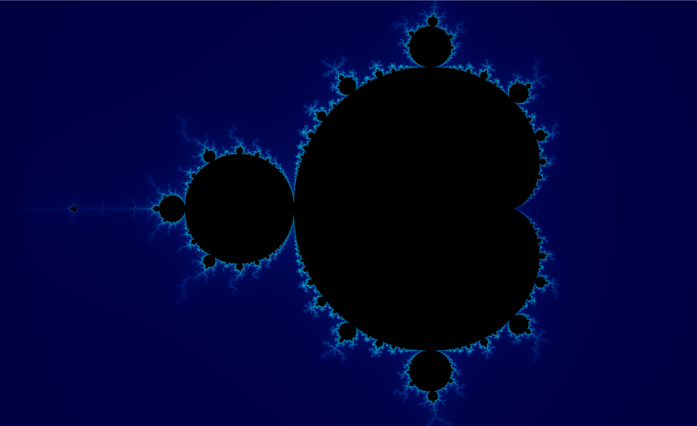
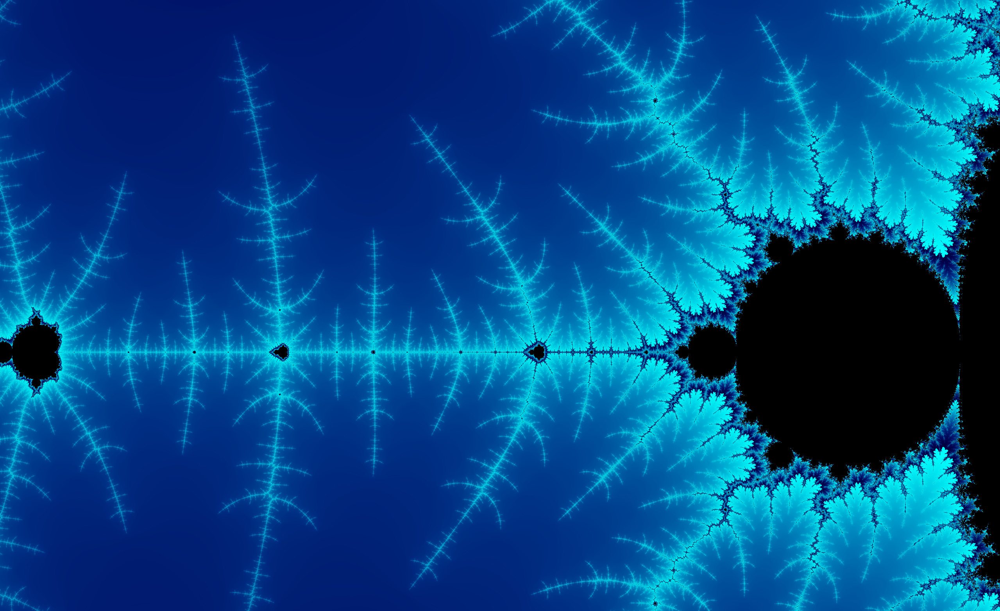

A small GPU-powered Mandelbrot set explorer, built as a for-fun side project.

## Why

I got interested in fractals — especially the Mandelbrot set — after watching a few videos on how it's generated. Instead of just watching, I wanted to see it myself, so I built this to zoom and pan around it live.

## How it works

A Java app (using LWJGL for the window/OpenGL context) renders a fullscreen quad, and a GLSL fragment shader does the real work: for each pixel it maps to a point on the complex plane, iterates `z = z² + c`, and colors it based on how fast it escapes (or leaves it black if it doesn't). Pixels are supersampled for smoother edges, and pan/zoom are uploaded as uniforms so exploration happens live.

## Controls

| Input | Action |
|---|---|
| `WASD` | Pan |
| Scroll / `+`/`-` | Zoom |
| `R` | Reset view |

## Stack

Java + LWJGL (GLFW/OpenGL) + GLSL.

## Running it

Built and run from IntelliJ. You'll need LWJGL (core, GLFW, OpenGL, natives) on the classpath, then run `Main.java`.

---

Just a learning project — rough edges included — but it did the job: watching the math turn into a zoomable fractal is a great way to actually understand it.
